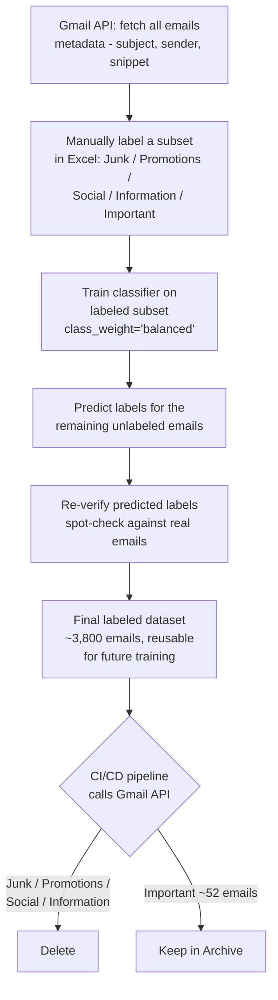

# Gmail API Automation — Email Classifier

An ML pipeline that connects to the Gmail API, pulls in your emails, and automatically classifies them into categories using a trained machine learning model. Built as an end-to-end project: data ingestion → preprocessing → model training → evaluation → prediction pipeline.

## Why I Built This

My Gmail inbox had **3,800+ emails** sitting in it — mostly junk, promotions, social notifications, and generic updates — and I wanted to clean it out. Gmail doesn't let you bulk-delete by "type" unless you manually go through and label/select things, and doing that for thousands of emails by hand wasn't realistic.

So instead of deleting everything manually, I turned it into an ML project:

1. **Pulled email metadata** for my whole inbox using the Gmail API (subject, sender, snippet, existing labels).
2. **Manually labeled a subset in Excel** — went through and tagged emails into categories (Junk, Promotions, Social, Information/Updates, Important).
3. **Trained a classifier** on that labeled subset, then used it to **predict labels for the remaining unlabeled emails**.
4. **Re-verified the predicted labels** — spot-checked the model's predictions against the actual emails to make sure the categories were trustworthy before acting on them.
5. **Used the labeled dataset (all ~3,800 emails) as the training data going forward**, so the same model can now classify new incoming mail without needing manual labeling again.
6. **Wired up a CI/CD pipeline that calls the Gmail API** to act on the labels — deleting/archiving everything tagged Junk, Promotions, Social, and Information, and keeping only what was classified as **Important** (which ended up being just **52 out of 3,800+ emails**).

I initially considered a more "clever" approach — a scheduled trigger (e.g., weekly) that labels that week's new mail and auto-deletes anything past a certain age once classified as non-important. I decided against it for now: I had no real use for the backlog of old mail, so a single one-time cleanup pass was simpler and solved the actual problem. The scheduled/rolling version is a natural next step if I want this to run continuously (see Roadmap).

## How the Pipeline Works



## Handling Class Imbalance

The label distribution was heavily skewed — categories like Promotions and Information had hundreds of examples, while Important had only a handful (52 out of 3,800+). Rather than oversampling or discarding data, the model was trained with **`class_weight='balanced'`**, which automatically re-weights the loss function so the minority class (Important) isn't drowned out by the majority classes during training. This keeps the training data as-is (no synthetic samples, no data loss from undersampling) while still pushing the model to pay attention to rare-but-critical categories — which matters here, since misclassifying an "Important" email as junk is a far more costly mistake than the reverse.

This is reflected in the metrics: despite class 4 (51 test samples) being one of the smaller classes, it still hit **1.00 precision** — the model didn't falsely flag other categories as this class, which is exactly the safety margin you want before letting a CI/CD job auto-delete things.

## A Note on the Dataset

There's no dataset included in this repo, and there won't be one. The training data is my own personal Gmail inbox — subject lines, senders, and snippets from real emails — so it isn't something that can be published or shared. If you want to reproduce this yourself, you'd need to pull and label your own inbox using the same pipeline; the code is reusable even though the data can't be.

## Optimizing for the Right Thing

Overall accuracy wasn't the goal I was optimizing for — **not misclassifying an Important email** was. In a 5-way classifier where one class (Important) makes up roughly 1% of the data, a model could hit 98%+ accuracy just by getting Important wrong every single time and still nailing everything else. That number would look great and still fail at the one job that mattered: not deleting something I actually needed.

So instead of chasing the highest overall accuracy, the priority was **precision and recall specifically on the Important class** — a false negative there (an important email predicted as Junk/Promotions/etc.) means it silently gets deleted by the CI/CD job, which is the one outcome this whole project exists to prevent. A false positive on Important (something unimportant kept around) is a non-issue — worst case, it just doesn't get cleaned up. That asymmetry is why `class_weight='balanced'` mattered more here than squeezing out a couple extra points of raw accuracy, and why the Important class hitting 1.00 precision / 0.86 recall in testing was the number I actually cared about, not the 91.68% overall figure.

## What It Does

- Authenticates with the **Gmail API** (OAuth2) to read email data
- Cleans and preprocesses raw email text (subject/body)
- Trains a classifier (scikit-learn / XGBoost / CatBoost) to sort emails into categories
- Exposes a simple `EmailClassifier` class for making predictions on new/unseen email text
- Tracks model performance with saved metrics after every training run

## Example

```python
from src.pipeline.predict_pipeline import EmailClassifier

classifier = EmailClassifier()
test_text = "LinkedIn got new job posts, data analyst"
label = classifier.predict(test_text)
print("Predicted:", label)
```

## Project Structure

```
gmail-api-automation/
├── .github/workflows/       # CI/CD configuration
├── notebook/                 # EDA and experimentation notebooks
├── src/
│   └── pipeline/
│       └── predict_pipeline.py   # EmailClassifier - loads trained model, runs predictions
├── main.py                   # Entry point / demo script
├── metrics.md                 # Auto-generated training & test metrics after each run
├── requirements.txt           # Python dependencies
├── setup.py                   # Package setup
└── README.md
```

## Tech Stack

| Component | Tools Used |
|---|---|
| Email Source | Gmail API (`google-api-python-client`, `google-auth-oauthlib`) |
| ML Models | scikit-learn, XGBoost, CatBoost |
| Data Handling | pandas, numpy |
| Visualization | matplotlib, seaborn, plotly |
| Serving (optional) | Flask |
| Notebooks | Jupyter |

## Model Performance

Latest run — **Test Accuracy: 91.68%** | **Train Accuracy: 96.22%**

```
              precision    recall  f1-score   support

           0       0.88      1.00      0.93        21
           1       0.91      0.85      0.88       263
           2       0.94      0.98      0.96       179
           3       0.91      0.93      0.92       447
           4       1.00      0.86      0.93        51

    accuracy                           0.92       961
```

> Full confusion matrices and per-run metrics are logged in [`metrics.md`](./metrics.md) every time the model is retrained.

## Setup

1. **Clone the repo**
   ```bash
   git clone https://github.com/VarunReddy-AI/gmail-api-automation.git
   cd gmail-api-automation
   ```

2. **Install dependencies**
   ```bash
   pip install -r requirements.txt
   ```

3. **Set up Gmail API credentials**
   - Go to [Google Cloud Console](https://console.cloud.google.com/) → create a project → enable the **Gmail API**
   - Create OAuth 2.0 credentials (Desktop app) and download `credentials.json`
   - Place `credentials.json` in the project root (it's git-ignored — never commit it)
   - On first run, a browser window will prompt you to authorize access; a `token.json` will be cached locally afterward

4. **Run the demo**
   ```bash
   python main.py
   ```

## Roadmap / Ideas

- [ ] Scheduled/rolling cleanup: trigger weekly, classify that week's new mail, and auto-delete non-important mail once it passes a certain age (instead of a one-time backlog cleanup)
- [ ] Auto-label incoming Gmail messages directly via the Gmail API (apply labels/move to folders) in real time
- [ ] Add an LLM-based agent layer to explain *why* an email was classified a certain way, before it gets deleted
- [ ] Web dashboard (Flask) to view classified inbox and override predictions
- [ ] Retrain pipeline automatically as new labeled data comes in via CI/CD

## Author

**Varun Reddy** — [GitHub](https://github.com/VarunReddy-AI)

## License

Add a license of your choice (MIT recommended for personal/portfolio projects).
